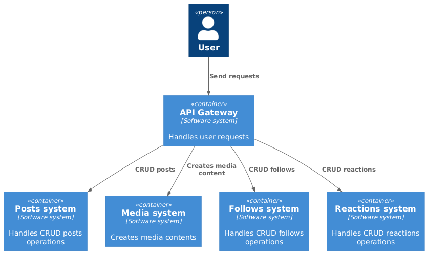
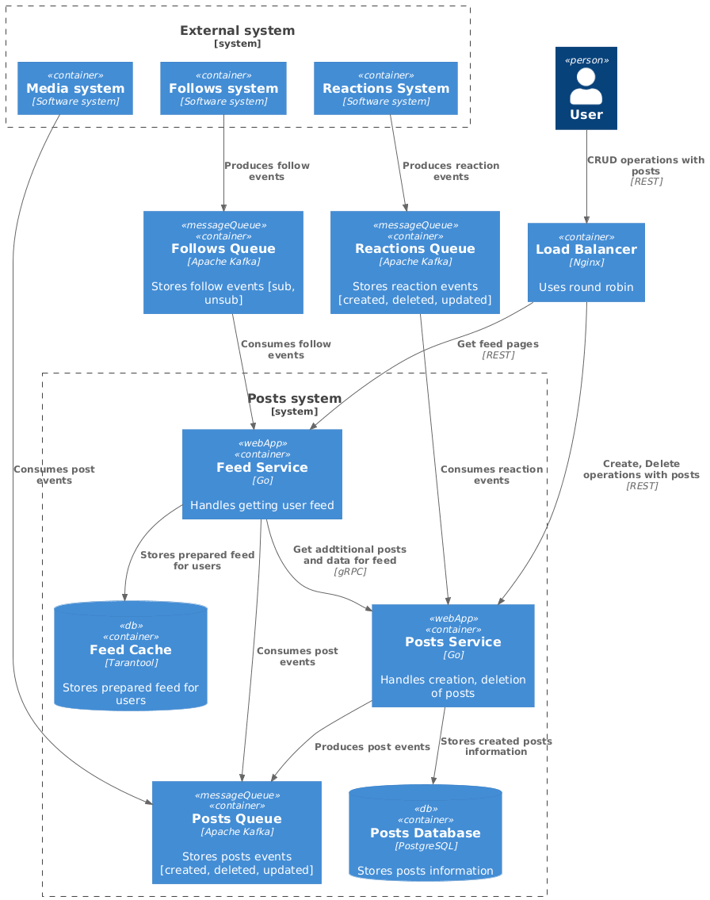
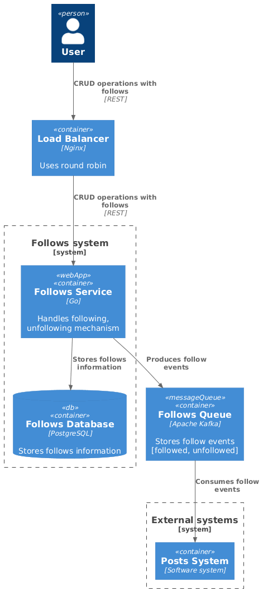
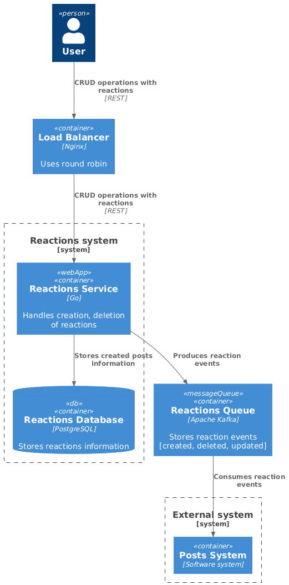
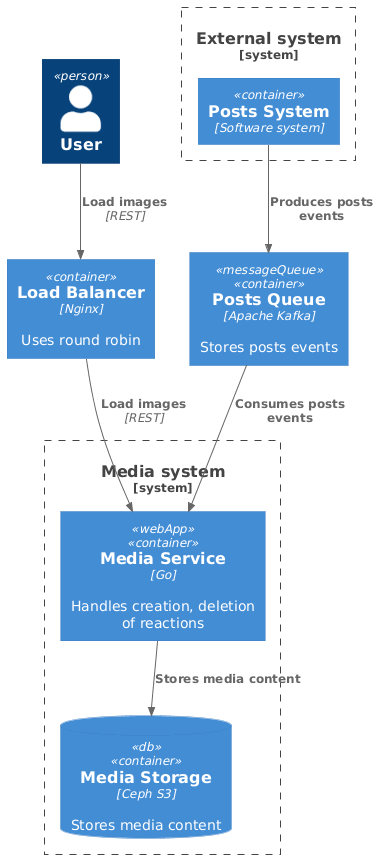

# Travelgram - System Design

---

### Функциональные требования:

- Публикация постов (фото, описание, локация);
- Оценка поста (лайк, комментарий);
- Подписка на других путешественников;
- Поиск популярных мест для путешествий и просмотр постов с этих мест;
- Просмотр ленты других путешественников и ленты пользователя.

### Нефункциональные требования:

- 10 000 000 DAU
- Доступность 99,95%
- Данные храним всегда
- Сезонность есть (лето, новогодние праздники. Множитель х2 на создание постов)
- Аудитория страны СНГ
- Активность пользователей:
  - пользователь в среднем делает 1 пост в неделю;
  - пользователь в среднем оценивает пост 3-5 раз в день;
  - пользователь в среднем комментирует 1 раз в день;
  - пользователь в среднем делает поиск мест 1 раз в день;
  - пользователь в среднем подписывается 1 раз в неделю;
  - пользователь в среднем просматривает ленту 20 раз в день.
- Лимиты
  - у пользователя может быть максимум 1 000 000 подписчиков
  - у пользователя может быть максимум 100 000 подписок
  - длина описания поста 200 символов
  - максимальная длина комментария 100 символов

- Тайминги
  - создание/изменение/удаление поста 1-2с
  - поиск популярных мест 2-3с
  - получение ленты пользователя 2-3с

### Нагрузка:

`Connections = 10 000 000 * 0.1 = 1 000 000`

- Подсистема постов:
  - `RPS(create_post) = 10 000 000 * (1/7) / 86 400 ~= 17`
  - `RPS(read_post) = 10 000 000 * 30 / 86 400 ~= 3 472`

- Подсистема реакций:
  - `RPS(like_post) = 10 000 000 * 5 / 86 400 ~= 579`
  - `RPS(comment_post) = 10 000 000 * 1 / 86 400 ~= 116`
  - `RPS(subscribe) = 10 000 000 * (1/7) / 86 400 ~= 17`

- Подсистема поиска:
  - `RPS(find_post_by_location) = 10 000 000 * 1 / 86 400 ~= 116`

**Post (780B)**
```
- post_id     (8B)
- user_id     (8B)
- created_at  (8B)
- description (400B) // Так как страны снг, то посты на русском 2B за символ
- image_url   (256B) // Длина ссылки на S3
- location    (100B)
```

### Traffic

- Подсистема постов:
  - Медиа:
    - `create_post = 17 * 3MB (фото) ~= 51 MB/s`
    - `read_post = 3 472 * 3MB (фото) ~= 10 GB/s`

  - Метаинформация:
      - `create_post = 17 * 780B ~= 13 KB/s`
      - `read_post = 3 472 * 780B ~= 2.7 MB/s`   

- Подсистема реакций:
    - `like_post = 579 * 8B (post_id) ~= 5 KB/s`
    - `comment_post = 116 * 208B (post_id + comment) ~= 24 KB/s`
    - `subscribe = 17 * 8B (user_id) ~= 136 B/s`

- Подсистема поиска:
    - `find_post_by_location = 116 * 100B ~= 12 KB/s`

## Оценка дисков

### Подсистема медиа
  - `Capacity = 51 MB/s * 86400 * 365 = 1.6PB (HDD - 50, SSD - 16, SSD-nVME - 54)`
  - `IOPS = 3500 (HDD - 35, SSD - 4, SSD-nVME - 1)`
  - `Throughput = 51 MB/s (HDD - 1, SSD - 1, SSD-nVME - 1)`

`Total_disks (HDD - 50, SSD - 16, SSD-nVME - 54)`

`Выбираем HDD.`

### Подсистема подписок
  - `Capacity = 1KB/s * 86400 * 365 ~= 32 GB (HDD - 1, SSD - 1, SSD-nVME - 1)`
  - `Disks_for_throughput = 1KB/s (HDD - 1, SSD - 1, SSD-nVME - 1)`
  - `IOPS = 17 (HDD - 1, SSD - 1, SSD-nVME - 1)`

`Total_disks (HDD - 1, SSD - 1, SSD-nVME - 1)`

`Выбираем HDD`

### Подсистема постов
  - `Capacity = 13KB/s * 86400 * 365 ~= 410 GB (HDD - 1, SSD - 1, SSD-nVME - 1)`
  - `Disks_for_throughput = 13KB/s (HDD - 1, SSD - 1, SSD-nVME - 1)`
  - `IOPS = 3500 (HDD - 35, SSD - 4, SSD-nVME - 1)`

`Total_disks (HDD - 35, SSD - 4, SSD-nVME - 1)`

`Выбираем SSD-nVME`

### Подсистема реакций

- `Capacity = 24 KB/s * 86400 * 365 + 5 KB/s * 86400 * 365 ~= 1 TB (HDD - 1, SSD - 1, SSD-nVME - 1)`
- `IOPS= 116 + 596 = 712 (HDD - 8, SSD - 1, SSD-nVME - 1)`
- `Throughput = 24KB/s + 5 KB/s = 29 KB/s (HDD - 1, SSD - 1, SSD-nVME - 1)`

`Total_disks = (HDD - 8, SSD - 1, SSD-nVME - 1)`

`Выбираем SSD`

## Дизайн системы

<p align="center">
    </br><b>Level 1.</b> System context diagram</br></br>
</p>

<p align="center">
  
</p>

<p align="center">
    </br><b>Level 2.</b> Posts system diagram</br></br>
</p> 

<p align="center">
  
</p>

<p align="center">
    </br><b>Level 2.</b> Follows system diagram</br></br>
</p> 

<p align="center">
  
</p>

<p align="center">
    </br><b>Level 2.</b> Reactions system diagram</br></br>
</p> 

<p align="center">
  
</p>

<p align="center">
    </br><b>Level 2.</b> Media system diagram</br></br>
</p> 

<p align="center">
  
</p>